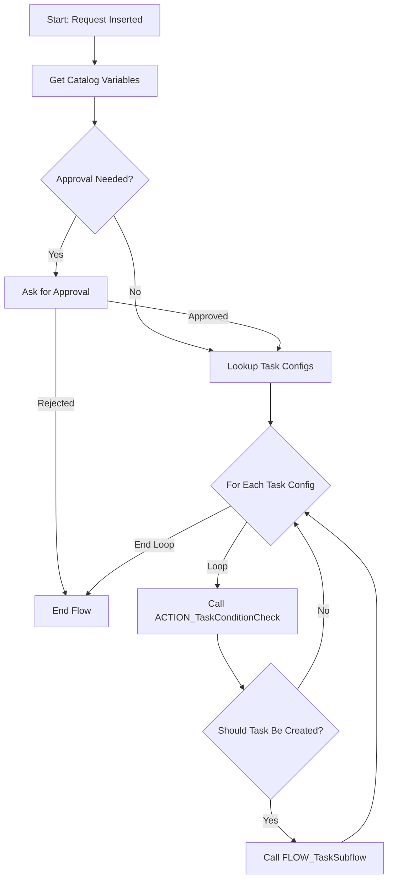

File: noderr/specs/FLOW_MainRequest.md

# FLOW_MainRequest.md

## Purpose
To serve as the primary orchestration engine for the entire Partner Onboarding process. This workflow is triggered upon the creation of a new Request record and manages the process from initial approval through the dynamic creation of all necessary fulfillment tasks.

## Current Implementation Status
✅ **IMPLEMENTED** - Component exists and is functional

## Implementation Details
- **Location**: `metadata/update/sys_hub_flow_66b0698193136650d5ec31697bba10e6.xml`
- **Current interfaces**:
    - **Trigger**: Automatically runs when a new record is inserted into the `x_1118046_partne_0_requests` table.
    - **Actions**: Calls the `Ask For Approval` flow action, looks up records in `MODEL_TaskConfig`, and calls the `FLOW_TaskSubflow`.
- **Dependencies**: `MODEL_Request`, `MODEL_TaskConfig`, `ACTION_TaskConditionCheck`, `FLOW_TaskSubflow`.
- **Dependents**: The entire business process depends on this flow to function.

## Core Logic & Functionality
1.  **Trigger:** The flow starts when a new `MODEL_Request` record is created.
2.  **Get Catalog Variables:** It retrieves all variables submitted through the `UI_RequestForm`.
3.  **Approval Logic:** It checks if the requester is exempt from approval. If not, it triggers the `Ask For Approval` action, sending an approval request to the requester's manager. The flow pauses until the approval is granted or rejected.
4.  **Task Configuration Lookup:** Upon approval, the flow performs a lookup on the `MODEL_TaskConfig` table to get the list of all potential tasks to be created.
5.  **Loop and Condition Check:** It iterates through each `Task Config` record. For each one, it calls the `ACTION_TaskConditionCheck` custom action to determine if the task is applicable to the current request.
6.  **Subflow Invocation:** If `ACTION_TaskConditionCheck` returns `true`, the main flow calls `FLOW_TaskSubflow`, passing the necessary data to create the specific fulfillment task.
7.  **Completion:** Once the loop is finished, the flow ends. The state of the parent `Request` is then managed by business rules (`SCRIPT_RequestStageManager`) based on the progress of the child tasks.

## Current Quality Assessment
- **Completeness**: The flow correctly orchestrates the approval and task generation process for all standard conditions.
- **Code Quality**: The flow is well-structured, using subflows and custom actions to promote reusability and readability. It follows ServiceNow Flow Designer best practices.
- **Test Coverage**: The end-to-end flow is the primary subject of the ATF suite (`TEST_ATFSuite`).
- **Documentation**: The flow has a clear description, and individual actions are annotated.

## Technical Debt & Improvement Areas
- **MVP Gap:** The flow's logic for calling `ACTION_TaskConditionCheck` is sound, but the action itself is missing the specific condition to trigger the University Verification task. The flow itself does not need to change, but its dependency (`ACTION_TaskConditionCheck`) does.

## Interface Definition

## ARC Verification Criteria

### Functional Criteria
- [ ] Verify that a new request for a non-exempt user correctly generates an approval request for their manager.
- [ ] Verify that a new request for an exempt user bypasses the approval step and proceeds directly to task creation.
- [ ] Verify that after approval, the flow correctly looks up records from the `MODEL_TaskConfig` table.
- [ ] Verify that the flow correctly calls the `FLOW_TaskSubflow` for each task that meets its conditions.
- [ ] Verify that a rejected approval correctly terminates the flow.

### Input Validation Criteria  
- [ ] N/A

### Error Handling Criteria
- [ ] Verify that if the `Ask For Approval` action fails (e.g., no manager found), the flow enters an error state and logs it.
- [ ] Verify that if the `FLOW_TaskSubflow` fails for one task, it does not prevent the loop from continuing to evaluate other tasks.

### Quality Criteria
- [ ] The flow should be easily understandable and maintainable through the Flow Designer UI.
- [ ] The use of a subflow for task creation should be maintained to keep the main flow clean.